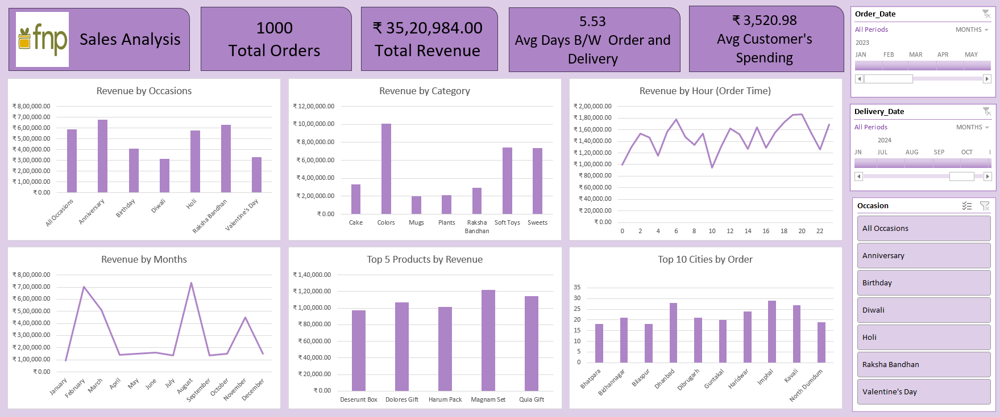

# fnp-sales-analysis-dashboard
An interactive sales and revenue analysis dashboard for FNP (Ferns N Petals) tracking orders, delivery efficiency, and seasonal trends.

# FNP Sales Analysis Dashboard 🎁

## Project Overview
This repository contains a comprehensive Sales Analysis Dashboard designed for FNP (Ferns N Petals). The dashboard provides a detailed, interactive view of e-commerce performance, tracking overall revenue, customer spending habits, seasonal trends, and delivery efficiency. 

## Key Performance Indicators (KPIs)
The dashboard tracks the following high-level metrics at a glance:
*   **Total Orders:** 1,000
*   **Total Revenue:** ₹ 35,20,984.00
*   **Avg Days B/W Order and Delivery:** 5.53 Days
*   **Avg Customer's Spending:** ₹ 3,520.98

## Key Insights & Visualizations
The dashboard is segmented into several key analytical views to help identify purchasing patterns:

*   **Revenue by Occasion:** Highlights peak sales drivers, showing strong performance during Anniversaries, Raksha Bandhan, and Valentine's Day.
*   **Revenue by Category:** Breaks down product performance, revealing 'Colors' and 'Sweets' as top-tier revenue generators compared to Cakes, Plants, or Mugs.
*   **Revenue by Hour (Order Time):** A line chart tracking purchasing times throughout a 24-hour cycle, helping to identify the most active shopping hours.
*   **Revenue by Months:** Illustrates seasonal sales volatility with distinct spikes, notably around February (likely Valentine's Day) and August (likely Raksha Bandhan).
*   **Top 5 Products by Revenue:** Highlights specific best-sellers (e.g., Magnam Set, Dolores Gift, Harum Pack).
*   **Top 10 Cities by Order:** Geographic mapping of order volume, highlighting strong market penetration in cities like Imphal, Dhanbad, and Haridwar.

## Interactive Features
The dashboard includes dynamic filtering capabilities for granular data exploration:
*   **Timeline Slicers:** Filter data specifically by `Order_Date` or `Delivery_Date` down to the exact month.
*   **Occasion Filter:** A dedicated toggle menu to isolate data by specific events (Anniversary, Birthday, Diwali, Holi, Raksha Bandhan, Valentine's Day).

## How to Use
1.  Clone this repository or download the dashboard file.
2.  Open the file in the respective BI or Spreadsheet tool.
3.  Use the right-hand filter panel to interact with the data and isolate specific dates or occasions.
